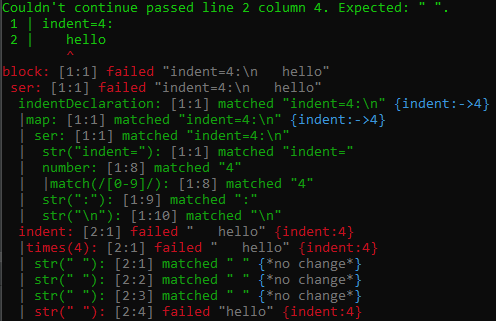

# Parsinator.js

Yet another [parser combinator](http://en.wikipedia.org/wiki/Parser_combinator) library with a couple unique features:

* State, which helps for contextful languages of any reasonable amount of complexity (like ones that have LR conflicts or whitespace delimiting).
* Powerful debug recording and displaying. This can be enormously helpful figuring out why your parser isn't working as you expect.

## Parser Combinators

A parser combinator 

## Example

This example shows a set of parsers where `block` is the main one. In `block`, there is an "indentDeclaration" where the indent of the following line is defined. Then it looks for the string "hello" on the next line after the declared indent.

The indent is kept track of using parser state set with `this.set` and retrieved using `this.get`.

Also, notice that `block().debug()` is what `parse` is called on. This means a debug record will be built that will then also be displayed by the `displayResult` function.

```javascript
const parsers = lazyParsers({
  block: function() {
    return ser(indentDeclaration, indent, str('hello'))
  },
  indent: function() {
    return times(this.get('indent'), str(' '))
  },
  indentDeclaration: function() {
    return ser(str('indent='), number, str(':'), str('\n')).value(function(value) {
      this.set('indent', Number(value[1]))
      return value
    })
  },
  number: function() {
    return regex(/[0-9]/)
  },
})
eval(importParsers(parsers, 'parsers'))

const result = block().debug().parse(
  "indent=4:\n"+
  "   hello"
)
console.log(displayResult(result))
```

The output of this also shows the debugging capability:



See the full working example file at [examples/stateDemo.js](examples/stateDemo.js).

## More [Examples](examples)

There's a number of examples that show various aspects of using parsinator.js. 

## Install

`npm install parsinator.js`

## Importing

```javascript
const {
  str, regex, alt, ser, times, // ...
  lazyParsers, importParsers, // ...
  displayResult // ...
} = require("parsinator.js")
```

## Usage

Parsinator.js parsers operate on a string and step through the string attempting to match the parser that make up your language. Some parser combinators (primarily `alt`) backtrack when a parser fails, and continues from the point where there's another alternative to try. Every parser returns a value when success and usually moves the index forward, where the next parser will start parsing from. 

Every parser returns a `ParseResult` that indicates whether it succeeded (`ok=true`) or failed (`ok=false`). A successful `ParseResult` contains the `value` returned by the parser. A failed `ParseResult` contains the input it `expected` to receive. There are more details in [docs/core.md](docs/core.md).

For convenience, any place that expects a `Parser` can also accept a string, a RegExp, or an argumentless function that returns a `Parser`.

```
const hello = str('hello')
const hello2 = function() { return str('hello') }

ser(hello, hello2).parse('hellohello') // Succeeds
```


The code is internally split into separate logical modules, and this documentation will use that separation as a way to compartmentalize the parts of this library. We'll start with the most useful part of the library.

### [Parsers](docs/parsers.md)

Basic Parsers: `eof`, `ok`, `fail`, `str`, `regex`, `ser`, `alt`, `many`, `atLeast`, `atMost`, `times`, `timesBetween`, `not`, `peek`, `name`, `desc`, `node`

More Parsers: `listOf`, `seriesSepBy`, `memoize`

The basic parsers are the bread and butter of this library. You'll probably use these parsers more than any other. The "more parsers" are more complex or higher level parsers. 

### [Core and custom parsers](docs/core.md)

Classes: `Parser`

Functions: `isParser`, `getPossibleParser`

If the basic parsers can't do what you need to do for some reason, you can write your own low-level parser using the `Parser` class.

### [`lazy` and importing parsers](docs/lazy.md)

Parsers: `lazy`

Functions: `lazyParsers`, `importParsers`

The primary function of `lazy` is that it allows you to create recursive parsers. `lazyParsers`, `importParsers` are convenience methods that can be used to write a set of parsers and import them into scope (as seen in the example above).

### [Human readable output](docs/display.md)

Functions: `displayResult`, `displayDebugInfo`

Classes: `InputInfoCache`

`displayResult` and `displayDebugInfo` display the result of parsing in a human readable way. `InputInfoCache` is a class for transforming indexes into line and column numbers.

## Structure

[`core.js`](src/core.js) contains the base-level functionality everything else is built on. [`parsers.js`](src/parsers.js) contains the basic parsers built on top of that core. [`lazy.js`](src/lazy.js) contains important functionality for creating parsers that can recurse properly among other things, also built on top of `core.js`. [`moreParsers.js`](src/moreParsers.js) contains higher-level parsers built on top of the basic parsers inside `parsers.js`. [`display.js`](src/display.js) contains functionality for displaying human readable information about parse results.

All of the exports of these files are combined and exposed through the main script of the module:
[`parsinator.js`](parsinator.js).


## Todo
* Figure out if you want state to propagate downward
* make a note about ignoring parser results in custom parsers notes - related to ignoreSep
* more custom parsers notes
 * Note about using `Context.ok` or `Context.fail` on the most recent parse context. But make the opposite note if you decide state shouldn't be propagated downwards.
* Write up details on how to interpret debug trace output
* write up tutorial (note that the tutorial doesn't cover anything that isn't in the reference docs, but vice versa is not true)
* Support streaming input.
* See if parsing unicode presents unique challenges as is mentioned in https://github.com/GregRos/parjs
* Investigate what [parjs](https://github.com/GregRos/parjs)'s traces look like
* Mention somewhere to be careful about using new style lambda functions, because they don't retain their own `this` and thus won't be able to access the current context (but may instead access an upper context).
* Inform people (SO?)
