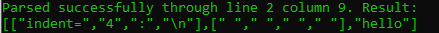
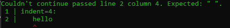

# Human readable output

**`displayResult(result, options)`** - Displays the result, showing information about how far it successfully parsed or where it failed and what it expected. It also displays debug results just like `displayDebugInfo` if debug results are available.

* `options` - An object containing the following optional properties:
  * `colors` - (Default: `true`) If `true`, text will be colorized. Otherwise output won't be colored differently from the default.
  * `indicatorColor(text)` - (Default: red) A function returning the input text colorized for the console. Used for the ^ indicator showing the farthest the parser was able to get.
  * `inputInfoCache` - An `InputInfoCache` instance for getting line and column numbers from the input.
  * `stateDisplay(startState, endState)`

Success:

Failure:

**`displayDebugInfo(result, options)`** - Displays the debug record inside `result`.

* `result` - A `ParseResult` object.
* `options` - An object containing the following optional properties:
  * `maxMatchChars` - (Default: 30) The maximum number of matching characters to display after each entry. Matches that exceed that will be truncated.
  * `maxSubrecordDepth` - (Default: 75) The maximum depth to display subrecords to. Since subrecords are indented 1 character further than the parent record, this implicitly limits the maximum indent.
  * `colors` - (Default: `true`) If `true`, text will be colorized. Otherwise output won't be colored differently from the default.
  * `inputInfoCache` - An `InputInfoCache` instance for getting line and column numbers from the input.
  * `stateDisplay(startState, endState)`
  
  

**`InputInfoCache(input)`** - A class for mapping index numbers to line and column numbers (and vice versa) from an input. It also caches this information for performant repeated retrieval.

* `input` - The target string input.

**`inputInfoCache.get(index)`** - Gets line and column numbers that correspond to the `index`. Returns an object with the following properties:

* `line` - 1-based line number.
* `column` - 1-based column number.

**`inputInfoCache.getLineIndex(lineNumber)`** - Returns the `index` at which the passed 1-based `lineNumber` starts.

